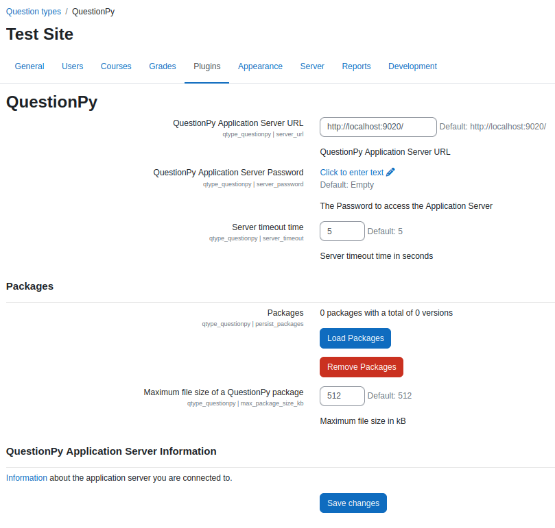

# The Moodle Plugin

The QuestionPy Moodle plugin

## Installation

[//]: # (TODO: update the moodle docs link if the compatibility changes) 

For a general guide on how to install a _Moodle_ Plugin, you can look up the documentation under:
[Installing plugins - MoodleDocs](https://docs.moodle.org/403/en/Installing_plugins)

## Customization 

To edit the plugin settings, navigate to _Site Administration > Plugins > Question types > QuestionPy_.

## Licensing

As a Moodle Plugin, this software has to be licensed as [GNU GPLv3](https://github.com/questionpy-org/moodle-qtype_questionpy/blob/dev/LICENSE).

