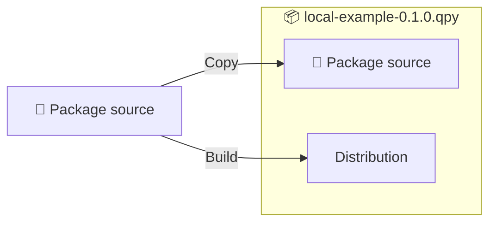

# Building

Packaging a QuestionPy project involves creating a `.qpy` package file from a source directory. These files can be
readily distributed, uploaded to an LMS, or shared with colleagues.

*[LMS]: Learning management system

To generate a `.qpy` package from a source directory, execute the following command:

```sh
$ questionpy-sdk package SOURCE_DIRECTORY
```

!!! info "Package naming"

    The `.qpy` file follows this default pattern: `NAMESPACE-SHORTNAME-VERSION.qpy`, like
    `my_namespace-my_project-0.1.0.qpy`.

## Source backup

QuestionPy will automatically back up the source code by storing a copy in the `.qpy` package. This feature allows you
to restore the complete source from a `.qpy` package whenever needed.

<figure markdown="span">

<figcaption>Project packaging</figcaption>
</figure>

## Build hooks

Customize the build process by executing additional steps before or after building the `.qpy` package. Typical tasks
involve:

- transpiling JavaScript,
- minifying CSS, or
- executing a test suite.

Utilize the [`build_hooks` configuration option][build_hooks_option] to execute arbitrary commands. Specify commands to
run before or after the build process using either `pre` or `post`. Commands can be defined as a single string or a
list. If any command fails (returns a non-zero value), the build process will fail.

  [build_hooks_option]: configuration.md#build_hooks

!!! example

    ```yaml
    build_hooks:
       pre:
         - npm install
         - postcss styles/default.css --output css/default.css
    ```
